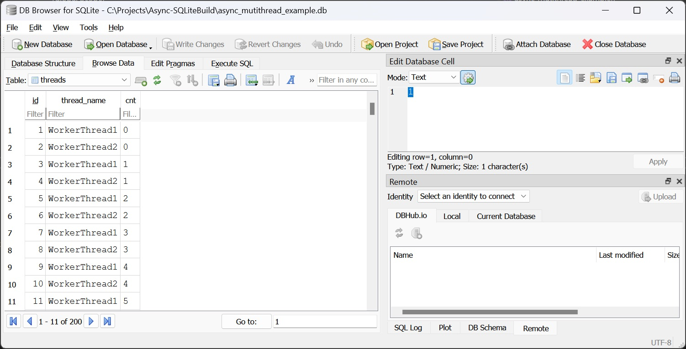

# Asynchronous SQLite API using C++ Delegates

An asynchronous SQLite API wrapper implemented using a C++ delegate libraries. All target platforms are supported including Windows, Linux, and embedded systems.

# Table of Contents

- [Asynchronous SQLite API using C++ Delegates](#asynchronous-sqlite-api-using-c-delegates)
- [Table of Contents](#table-of-contents)
- [Overview](#overview)
- [References](#references)
- [Project Build](#project-build)
  - [Windows Visual Studio](#windows-visual-studio)
  - [Linux Make](#linux-make)
- [Delegate Quick Start](#delegate-quick-start)
- [Why Asynchronous SQLite](#why-asynchronous-sqlite)
- [Asynchronous SQLite](#asynchronous-sqlite)
- [Examples](#examples)
  - [Simple Example](#simple-example)
  - [Simple Example Block Execute](#simple-example-block-execute)
  - [Multithread Example](#multithread-example)

# Overview

SQLite is a lightweight, serverless, self-contained SQL database engine commonly used for embedded applications and local data storage. The C++ delegate library is a multi-threaded framework capable of anonymously targeting any callable function, either synchronously or asynchronously. This delegate library is used to create an asynchronous API for SQLite. SQLite operates in a private thread of control, with all client API calls being invoked asynchronously on this private thread. The SQLite asynchronous wrapper makes no changes to the SQLite API, except for the addition of a trailing timeout argument for wait duration.

The purpose of the wrapper is twofold: First, to provide a simple asynchronous layer over SQLite, and second, to serve as a working example of an asynchronous delegate library or subsystem interface.

# References

* <a href="https://github.com/endurodave/AsyncMulticastDelegateModern">Asynchronous Multicast Delegates in Modern C++</a> - A C++ standards compliant delegate library capable of targeting any callable function synchronously or asynchronously.
*  <a href="https://github.com/endurodave/StdWorkerThread">Asynchronous Multicast Delegates in Modern C++</a> - A C++ standards compliant delegate library capable of targeting any callable function synchronously or asynchronously.
* <a href="https://www.sqlite.org/">SQLite</a> - SQLite is a C-language library that implements a small, fast, self-contained, high-reliability, full-featured, SQL database engine.
* 
# Project Build

<a href="https://www.cmake.org">CMake</a> is used to create the build files. CMake is free and open-source software. Windows, Linux and other toolchains are supported. Example CMake console commands executed inside the project root directory: 

## Windows Visual Studio

<code>cmake -G "Visual Studio 17 2022" -A Win32 -B ../Async-SQLiteBuild -S .</code>

After executed, open the Visual Studio project from within the <code>Async-SQLiteBuild</code> directory.

## Linux Make

<code>cmake -G "Unix Makefiles" -B ../Async-SQLiteBuild -S .</code>

After executed, build the software from within the Async-SQLiteBuild directory using the command <code>make</code>. Run the console app using <code>./Async-SQLiteApp</code>.

# Delegate Quick Start

The DelegateLib contains delegates and delegate containers. The example below shows creating a delegate with the target function `MyTestFunc()`. The first example shows how to synchronously call a function, and the second example asynchronously. Notice the only difference is adding a thread instance `myThread` argument. See [Delegate Library](https://github.com/endurodave/AsyncMulticastDelegateModern) repository for more details.

```cpp
#include "DelegateLib.h"

using namespace DelegateLib;

void MyTestFunc(int val)
{
    printf("%d", val);
}

int main(void)
{
    // Create a synchronous delegate
    auto syncDelegate = MakeDelegate(&MyTestFunc);

    // Invoke MyTestFunc() synchronously
    syncDelegate(123);

    // Create an asynchronous delegate
    auto asyncDelegate = MakeDelegate(&MyTestFunc, myThread);

    // Invoke MyTestFunc() asynchronously
    asyncDelegate(123);
}
```

# Why Asynchronous SQLite

* **Improved Performance:** Offloading SQLite operations to a separate thread allows the main thread to remain responsive, enhancing overall application performance.
* **Non-blocking Operations:** By executing database queries in a separate thread, the main application thread can continue processing other tasks without waiting for SQLite operations to complete.
* **Isolation:** Running SQLite on a private thread ensures that database-related tasks are isolated from the main application logic, reducing the risk of thread contention or deadlock in the main application.

A side benefit is a real-world example a cross-threaded application using the delegate library. 

# Asynchronous SQLite

The file `async_sqlite3.h` implement the asynchronous interface. Each async function matches the SQLite library with the addition of a `timeout` argument.

```cpp
namespace async
{
    #undef max  // Prevent compiler error on next line if max is defined
    constexpr auto MAX_WAIT = std::chrono::milliseconds::max();

    // Call one-time at application startup
    void sqlite3_init_async(void);

    // Get a pointer to the internal thread
    DelegateLib::DelegateThread* sqlite3_get_thread(void);

    SQLITE_API int sqlite3_open(
        const char* filename,   /* Database filename (UTF-8) */
        sqlite3** ppDb,         /* OUT: SQLite db handle */
        std::chrono::milliseconds timeout = MAX_WAIT
    );

    SQLITE_API int sqlite3_exec(
        sqlite3* db,                /* The database on which the SQL executes */
        const char* zSql,           /* The SQL to be executed */
        sqlite3_callback xCallback, /* Invoke this callback routine */
        void* pArg,                 /* First argument to xCallback() */
        char** pzErrMsg,            /* Write error messages here */
        std::chrono::milliseconds timeout = MAX_WAIT
    );

    SQLITE_API int sqlite3_close(
        sqlite3* db,
        std::chrono::milliseconds timeout = MAX_WAIT
    );

    // TODO: Add more sqlite async API's as necessary
}
```

The file `async_sqlite3.cpp` implements each function. 

```cpp
void async::sqlite3_init_async(void)
{
    // Create the worker thread
    SQLiteThread.CreateThread();
}

DelegateLib::DelegateThread* async::sqlite3_get_thread(void)
{
    return &SQLiteThread;
}

SQLITE_API int async::sqlite3_open(
    const char* filename,   /* Database filename (UTF-8) */
    sqlite3** ppDb,         /* OUT: SQLite db handle */
    std::chrono::milliseconds timeout
)
{
    // Asynchronously invoke ::sqlite3_open on the SQLiteThread thread
    auto retVal = AsyncInvoke(::sqlite3_open, timeout, filename, ppDb);
    return retVal;
}

SQLITE_API int async::sqlite3_exec(
    sqlite3* db,                /* The database on which the SQL executes */
    const char* zSql,           /* The SQL to be executed */
    sqlite3_callback xCallback, /* Invoke this callback routine */
    void* pArg,                 /* First argument to xCallback() */
    char** pzErrMsg,            /* Write error messages here */
    std::chrono::milliseconds timeout
)
{
    auto retVal = AsyncInvoke(::sqlite3_exec, timeout, db, zSql, xCallback, pArg, pzErrMsg);
    return retVal;
}

SQLITE_API int async::sqlite3_close(
    sqlite3* db,
    std::chrono::milliseconds timeout
)
{
    auto retVal = AsyncInvoke(::sqlite3_close, timeout, db);
    return retVal;
}

// TODO: Add more sqlite async API's as necessary
```

The `AsyncInvoke()` helper function invokes the function asynchronously if the caller is not executing on the `SQLiteThread` thread. Otherwise, if the caller is already on the internal thread and the target function is called synchronously. 

```cpp
// A private worker thread instance to execute all SQLite API functions
static WorkerThread SQLiteThread("SQLite Thread");

/// Helper function to simplify asynchronous function calling on SQLiteThread
/// @param[in] func - a function to invoke
/// @param[in] timeout - the time to wait for invoke to complete
/// @param[in] args - the function argument(s) passed to func
template <typename Func, typename Timeout, typename... Args>
auto AsyncInvoke(Func func, Timeout timeout, Args&&... args)
{
    // Deduce return type of func
    using RetType = decltype(func(std::forward<Args>(args)...));  

    // Is the calling function executing on the SQLiteThread thread?
    if (SQLiteThread.GetThreadId() != WorkerThread::GetCurrentThreadId())
    {
        // Create a delegate that points to func and is invoked on SQLiteThread
        auto delegate = DelegateLib::MakeDelegate(func, SQLiteThread, timeout);

        // Invoke the delegate target function asynchronously and wait for function call to complete
        auto retVal = delegate.AsyncInvoke(std::forward<Args>(args)...);

        // Did the async function call succeed?
        if (retVal.has_value())
        {
            // Return the target functions return value
            return retVal.value();  
        }
        // Else async function call failed
        else
        {
            if constexpr (std::is_pointer_v<RetType>) 
            {
                // If return type is a pointer, return nullptr for errors
                return nullptr;
            }
            if constexpr (std::is_same_v<RetType, int>) 
            {
                // Special case for int, return SQLITE_ERROR
                return SQLITE_ERROR;
            }
            else 
            {
                // Return default-constructed value of the return type if the async call fails
                return RetType{};
            }
        }
    }
    else
    {
        // Invoke the target function synchronously since already executing on SQLiteThread
        return func(std::forward<Args>(args)...);
    }
}
```

# Examples

The `main()` loop executes example code.

```cpp
int main(void)
{
    // Create all worker threads
    for (int i=0; i<WORKER_THREAD_CNT; i++)
        workerThreads[i].CreateThread();

    // Initialize async sqlite3 interface
    async::sqlite3_init_async();

    // Run simple example. Each database call is invoked on the SQLite internal thread.
    async_sqlite_simple_example();

    // Run simple example entirely on the internal async SQLite thread. This shows how 
    // to execute multiple SQL commands uninterrupted.
    DelegateLib::DelegateThread* sqlThread = async::sqlite3_get_thread();
    auto delegate = DelegateLib::MakeDelegate(&async_sqlite_simple_example, *sqlThread, std::chrono::milliseconds::max());
    delegate.AsyncInvoke();

    // Run multithreaded example
    async_mutithread_example();

    // Exit all worker threads
    for (int i = 0; i < WORKER_THREAD_CNT; i++)
        workerThreads[i].ExitThread();

	return 0;
}
```

## Simple Example

The `async_sqlite_simple_example()` writes to the database first and last name using the `async` API. Each function call matches the underlying SQLite library exactly. A call to `async::sqlite3_open()`, for instance, sends a function pointer and all arguments to the `SQLiteThread`, the target function is invoked on the internal thread, and the return value `rc` is returned to the caller. In short, every `async` API call injects a message into a queue for later execution on  `SQLiteThread`.

```cpp
// Simple example to create and write to the database asynchronously. 
// Use async::sqlite3_<func> series of functions within the async namespace.
int async_sqlite_simple_example()
{
    sqlite3* db;
    char* errMsg = 0;
    int rc;

    // Step 1: Open (or create) the SQLite database file
    rc = async::sqlite3_open("async_sqlite_simple_example.db", &db);

    if (rc) 
    {
        fprintf(stderr, "Can't open database: %s\n", sqlite3_errmsg(db));
        return(0);
    }
    else 
    {
        printf_safe("Opened database successfully\n");
    }

    // Step 2: Create a table if it does not exist
    const char* createTableSQL = "CREATE TABLE IF NOT EXISTS people ("
        "id INTEGER PRIMARY KEY AUTOINCREMENT, "
        "first_name TEXT NOT NULL, "
        "last_name TEXT NOT NULL);";

    rc = async::sqlite3_exec(db, createTableSQL, callback, 0, &errMsg);
    if (rc != SQLITE_OK) 
    {
        fprintf(stderr, "SQL error: %s\n", errMsg);
        sqlite3_free(errMsg);
        return 1;
    }
    else 
    {
        printf_safe("Table created successfully or already exists\n");
    }

    // Step 3: Insert a record
    const char* insertSQL = "INSERT INTO people (first_name, last_name) "
        "VALUES ('John', 'Doe');";

    rc = async::sqlite3_exec(db, insertSQL, callback, 0, &errMsg);
    if (rc != SQLITE_OK) 
    {
        fprintf(stderr, "SQL error: %s\n", errMsg);
        sqlite3_free(errMsg);
    }
    else 
    {
        printf_safe("Record inserted successfully\n");
    }

    // Step 4: Verify the insertion by querying the table
    const char* selectSQL = "SELECT * FROM people;";

    rc = async::sqlite3_exec(db, selectSQL, callback, 0, &errMsg);
    if (rc != SQLITE_OK) 
    {
        fprintf(stderr, "SQL error: %s\n", errMsg);
        sqlite3_free(errMsg);
    }
    else 
    {
        printf_safe("Query executed successfully\n");
    }

    // Step 5: Close the database connection
    async::sqlite3_close(db);
    return 0;
}
```

## Simple Example Block Execute

The previous example generated one queue message per `async` API call. Alternatively, the entire `async_sqlite_simple_example()` function can be executed on the `SQLiteThread`. 

```cpp
// Run simple example entirely on the internal async SQLite thread. This shows how 
// to execute multiple SQL commands uninterrupted.
DelegateLib::DelegateThread* sqlThread = async::sqlite3_get_thread();
auto delegate = DelegateLib::MakeDelegate(&async_sqlite_simple_example, *sqlThread, async::MAX_WAIT);
auto retVal = delegate.AsyncInvoke();
if (retVal.has_value())
    printf_safe("Return Value: %d\n", retVal.value());
```

A delegate callback within `async_sqlite_simple_example()` could be used to notify another thread when the asynchronous operation completes.

## Multithread Example

The `async_mutithread_example()` uses two separate threads to insert to the database concurrently. The lambda function `WriteDatabaseLambda` is invoked by two threads. When both worker threads are complete, the `async_multithread_example()` function returns.

```cpp
// Async SQLite multithread example. The WriteDatabaseLambda() function is called 
// from multiple threads of control. Function returns after all threads are complete.
int async_mutithread_example()
{
    char* errMsg = 0;
    int rc;

    // Step 1: Open (or create) the SQLite database file
    rc = async::sqlite3_open("async_mutithread_example.db", &db_multithread);

    if (rc)
    {
        fprintf(stderr, "Can't open database: %s\n", sqlite3_errmsg(db_multithread));
        return(0);
    }
    else
    {
        printf_safe("Opened database successfully\n");
    }

    // Step 2: Create a table if it does not exist
    const char* createTableSQL = "CREATE TABLE IF NOT EXISTS threads ("
        "id INTEGER PRIMARY KEY AUTOINCREMENT, "
        "thread_name TEXT NOT NULL, "
        "cnt TEXT NOT NULL);";

    rc = async::sqlite3_exec(db_multithread, createTableSQL, callback, 0, &errMsg);
    if (rc != SQLITE_OK)
    {
        fprintf(stderr, "SQL error: %s\n", errMsg);
        sqlite3_free(errMsg);
        return 1;
    }
    else
    {
        printf_safe("Table created successfully or already exists\n");
    }

    // Lambda function to write data to SQLite database
    auto WriteDatabaseLambda = +[](std::string thread_name) -> void
    {
        char* errMsg = 0;
        int rc;
        static int cnt = 0;

        for (int i = 0; i < 100; i++)
        {
            // Step 3: Insert a record
            std::string insertSQL = "INSERT INTO threads (thread_name, cnt) "
                "VALUES ('" + thread_name + "', '" + std::to_string(i) + "');";

            rc = async::sqlite3_exec(db_multithread, insertSQL.c_str(), callback, 0, &errMsg);
            if (rc != SQLITE_OK)
            {
                fprintf(stderr, "SQL error: %s\n", errMsg);
                sqlite3_free(errMsg);
            }
            else
            {
                printf_safe("Record inserted successfully\n");
            }
        }

        // Step 4: Verify the insertion by querying the table
        const char* selectSQL = "SELECT * FROM threads;";

        rc = async::sqlite3_exec(db_multithread, selectSQL, callback, 0, &errMsg);
        if (rc != SQLITE_OK)
        {
            fprintf(stderr, "SQL error: %s\n", errMsg);
            sqlite3_free(errMsg);
        }
        else
        {
            printf_safe("Query executed successfully\n");
        }

        // Last thread complete?
        if (++cnt >= WORKER_THREAD_CNT)
        {
            std::lock_guard<std::mutex> lock(mtx);  // Lock the mutex to modify shared state
            ready = true;  // Set the shared condition to true, meaning threads are complete

            cv.notify_all();  // Notify waiting threads time to exit
        }
    };

    // Invoke WriteDatabaseLambda lambda function on worker thread
    for (int i = 0; i < WORKER_THREAD_CNT; i++)
    {
        // Create an async delegate to invoke WriteDatabaseLambda()
        auto delegate = MakeDelegate(WriteDatabaseLambda, workerThreads[i]);
        
        // Invoke async target function WriteDatabaseLambda() on workerThread[i] non-blocking
        // i.e. invoke the target function and don't wait for the return.
        delegate(workerThreads[i].GetThreadName());
    }

    // Lock the mutex and wait for the signal from WriteDatabaseLambda
    std::unique_lock<std::mutex> lock(mtx);

    // Wait for all WriteDatabaseLambda worker threads to complete
    while (!ready)
        cv.wait(lock);  // Block the thread until notified

    // Step 5: Close the database connection
    async::sqlite3_close(db_multithread);
    return 0;
}
```

Use *DB Browser for SQLite* tool to examine the results. Notice the interleaving of data by both threads.

